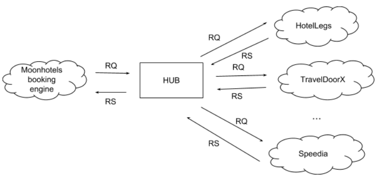

# Project Title

Hotel Moon HUB

## Statement

# Moonhotels' HUB
Moonhotels, a new Hotelverse client, is a company that sells hotel room stays. Its core product is a booking engine that connects to external providers to return the availability of rooms and applies Moonhotels business rules.

In order to pay the technical debt that has been increasing in the last years, they decided to create a new HUB that will be in charge of request information to the providers and aggregate the results in a unique response.

This new HUB will only have one method, Search, that will execute the following flow:
1. Receive a search request in common format (HUB format).
1. Translate the HUB's search request to multiple search requests, one for every provider. All providers have a different search format.
1. Translate every provider response (in a different format for each one) to a response in the HUB format.
1. Aggregate the different responses in only one.

The HUB will connect to a lot of different providers: HotelLegs, TravelDoorX, Speedia, etc.

For an initial phase of the project, there are two main tasks:
1. Create the HUB system that allows to connect to several providers.
1. Create the HotelLegs provider integration.

# Architecture overview


# HUB Search format
Request:
```json
{
    "hotelId": 1,
    "checkIn": "2018-10-20",
    "checkOut": "2018-10-25",
    "numberOfGuests": 3,
    "numberOfRooms": 2,
    "currency": "EUR"
}
```
Response:
```json
{
    "rooms": [
        {
            "roomId": 1,
            "rates": [
                {
                    "mealPlanId": 1,
                    "isCancellable": false,
                    "price": 123.48
                },
                {
                    "mealPlanId": 1,
                    "isCancellable": true,
                    "price": 150.00
                }
            ]
        },
        {
            "roomId": 2,
            "rates": [
                {
                    "mealPlanId": 1,
                    "isCancellable": false,
                    "price": 148.25
                },
                {
                    "mealPlanId": 2,
                    "isCancellable": false,
                    "price": 165.38
                }
            ]
        }
    ]
}
```

# HotelLegs Search format
Request:
```json
{
    "hotel": 1,
    "checkInDate": "2018-10-20",
    "numberOfNights": 5,
    "guests": 3,
    "rooms": 2,
    "currency": "EUR"
}
```
Response:
```json
{
    "results": [
        {
            "room": 1,
            "meal": 1,
            "canCancel": false,
            "price": 123.48
        },
        {
            "room": 1,
            "meal": 1,
            "canCancel": true,
            "price": 150.00
        },
        {
            "room": 2,
            "meal": 1,
            "canCancel": false,
            "price": 148.25
        },
        {
            "room": 2,
            "meal": 2,
            "canCancel": false,
            "price": 165.38
        }
    ]
}
```

# Goal
Your task is to implement the **domain** of the HUB. In summary, you have to implement:
* The HotelLegs connector, that given a HUB request, it calls the HotelLegs API and returns a HUB response. 
* The HUB infrastructure that, given a a HUB request, calls all available connectors, return their responses and aggregate them in a single response.

You don't have to worry about HTTP, JSON and other infrastructure details, they will be handled by other team members.

One important task is that you define a ```IHotelLegsAPI``` interface with the Search method, as other team member will develop the implementation that performs the HTTP request.

## Description

This program is an API REST service, that recieves request from one common server, that request format is turned
into serveral formats, in order to send a request to others APIs each one in its format. We I recieve all responses,
the program format them into a common format and send it as the reponse of the request recieved.

## Getting Started

This application has been made with visual Studio.

###Versions

Folowing are the versions i used to made this program:

	* .Net Core: 6
	* Fluent Validations: 11.0.2
	* Moq: 4.18.1
	* Microsoft.AspNetCore.Mvc.Versioning.ApiExplorer: 5.0.0
	
### Dependencies

This program uses the following librarys from the Nuget admin:
    * AutoMapper.Extensions.Microsoft.DependencyInjection
    * Microsoft.NET.Test.Sdk
    * Moq
    * MSTest.TestAdapter
    * MSTest.TestFramework
	* FluentValidation
	* FluentValidation.AspNetCore

### Executing program

* How to run the program
* Step-by-step bullets
    -Play the program
    -Execute diferent functions in the Swagger

### Conventions:

This program has been made following the next conventions: SOLID, KIS and CleanCode.

## Codification

Here are some specifications over the code:

### Architecture

This program architecture is based in N-Layered Domain Oriented Architecture(more information here: https://usermanual.wiki/Pdf/NLayeredDomainOrientedArchitectureGuidewith20NET40.1411532101.pdf) .

#### Scheme of HUB API service:


In this application I decided not to do a CrossCutting layer at this version because it would be useless.

## Testing

The used framework is: MSTestv2.

In the 1.0 version test made are only the Application Layer ones, the UnitTests and the IntegrationTests.

It would be great to add a lot of extra tests but time doesn't allowed me to do that.

## Fluent Validations

There's so much casuistics I would loved to controll with fluent validantions, for example: if CheckInDate is earlier than CheckOutdate.

## Future Imporvements

Here are some little improvement I thought that would made this app better:
	*Add more Fluent Validations
	*Substitute the Providers List into a DataBase
	*Add custom exceptions

## Authors

Contributors names and contact info

	* Guillermo Cuenca Fornelio 
		** [@Wyllink](https://wylli.itch.io/).

## Version History
* 1.0
    * Initial Release